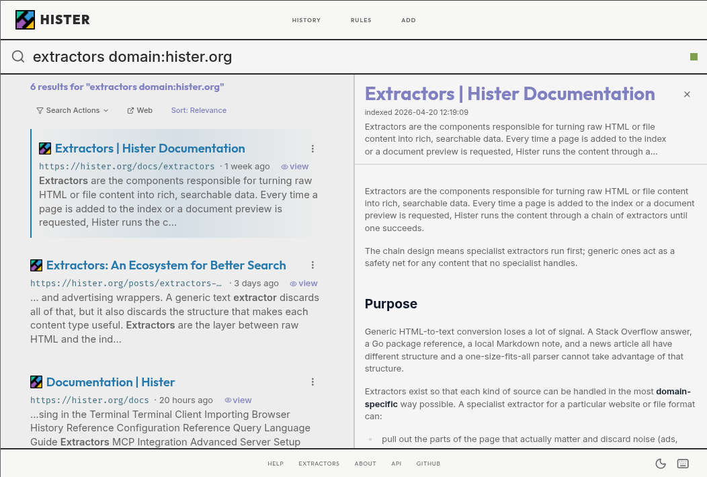

# Hister

**Your own search engine**

Hister is a general purpose web search engine providing automatic full-text indexing for visited websites.

## Features

- **Privacy-focused**: Keep your browsing history indexed locally - don't use remote search engines if it isn't necessary
- **Full-text indexing**: Search through the actual content of web pages you've visited
- **Advanced search capabilities**: Utilize a powerful [query language](https://hister.org/docs/query-language) for precise results
- **Local file indexing**: Index your local knowledge base
- **Crawler**: Use a (headless) browser or a traditional crawler to extend your index fast
- **Multi-user support**: Host it for your local community
- **AI enhanced**: Enable optional semantic search or connect your agents via MCP

## Check out our [Documentation](https://hister.org/docs) for more details

## [Support](https://hister.org/support) the development




## Development

**Requirements**: latest Go and NPM

- Clone the repository
- Build with `./manage.sh build` (or `go generate ./...; go build`)

To work on the web app with hot reload and automatic Go rebuilds:

```
npm run serve:app
```

This starts a Vite dev server (with HMR) and the Go backend (with auto-rebuild via [air](https://github.com/air-verse/air)) concurrently.

## Community

Join us on IRCNet: #hister or on [Discord](https://discord.gg/beEyuHxRSs)

## Contributing

Check the [CONTRIBUTING.md](CONTRIBUTING.md) for more information.

Bugs or suggestions? Visit the [issue tracker](https://github.com/asciimoo/hister/issues).

Security related issue? See our [SECURITY.md](SECURITY.md)

## License

[AGPLv3](LICENSE) or any later version
